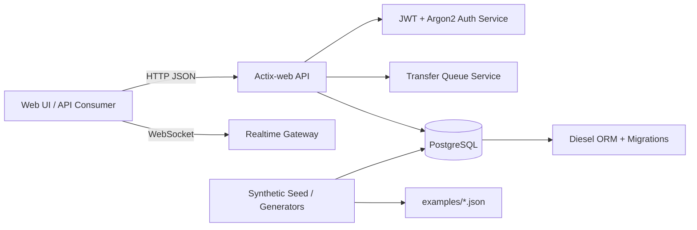

# Hporterly

<p align="center">
  
</p>

**Solution SaaS de gestion du brancardage et des flux patients**
<br />
**Hospital Patient Transfer Coordination & Operations System**


Rust/Actix backend for coordinating hospital patient transfer operations in a
fully generic and anonymized form. It provides queue management, priority and
status workflows, realtime updates (WebSocket), and synthetic demo data for evaluation.

- Version: `1.0.0`
- Author: Assan ABDOU-OUSSENI
- License: GPL-3.0-or-later (commercial license available)

> Strict rule: **Never commit real patient/facility data.**

## Key features

- Generic transfer request queue (no facility-specific references)
- Priorities and statuses
- History/event scaffolding
- JWT auth endpoint (demo-safe)
- WebSocket endpoint for realtime push wiring
- PostgreSQL + Diesel schema and migrations (15 migration folders)
- Seed/generator scripts for synthetic demo datasets
- CI safety checks for forbidden strings and secret-like patterns

## Quickstart

### Docker

```bash
git clone https://github.com/assaneben/Hporterly.git
cd Hporterly
cp .env.example .env
docker compose up --build
```

Services:

- API: `http://localhost:8080`
- Health: `http://localhost:8080/healthz`
- PostgreSQL: `localhost:5432`
- Frontend (optional compose service): `http://localhost:8081`

### Local development

Requirements:

- Rust 1.75+ (tested against current stable toolchains)
- PostgreSQL 15+ (compose uses PostgreSQL 17)
- Optional: `diesel_cli` for local migration workflows

```bash
cp .env.example .env
cargo run
```

Optional Diesel CLI:

```bash
cargo install diesel_cli --no-default-features --features postgres
diesel setup
diesel migration run
```

## Configuration (`.env.example`)

Key variables:

- `APP_HOST`, `APP_PORT`
- `DATABASE_URL`
- `JWT_SECRET`, `JWT_ISSUER`, `JWT_EXP_MINUTES`
- `CORS_ALLOWED_ORIGINS`
- `RUST_LOG`

All values in `.env.example` are placeholders only.

## Demo data

Two demo datasets are included under `examples/`:

- Minimal demo: transfer queue fields only (no patient fields)
- Full demo: strictly fake patient fields for UI/integration testing

All demo files include the header notice: `DEMO DATA — SYNTHETIC / NOT REAL`.

Seed/generator scripts:

- `scripts/seed_demo_users.py`
- `scripts/seed_demo_patients.py`
- `scripts/generate_fake_data.py`

## Architecture



## Security notes

- This repository provides **DEMO DATA only** (synthetic / not real).
- No production secrets or credentials are included.
- Production use with PHI/health-related data requires appropriate security,
  compliance, access control, backup, and audit controls.
- CI runs a sanity check that blocks forbidden organization aliases and obvious secrets.

## Roadmap

- SSO (OIDC/SAML)
- Expanded RBAC and policy enforcement
- Persistent audit trail export
- Optional HL7/FHIR connectors
- Advanced dispatching rules and SLA dashboards
- Metrics/tracing/observability

## Contributing

See `CONTRIBUTING.md`, `CODE_OF_CONDUCT.md`, and `SECURITY.md`.

## License

GPL-3.0-or-later. See `LICENSE`.

## Commercial licensing

Proprietary/commercial licensing is available for OEM/white-label deployments,
proprietary redistribution, and closed-source integrations.

- Email: `Couverture@ik.me`
- Alternative: Open a **Commercial License Request** issue using `.github/ISSUE_TEMPLATE/commercial_license_request.yml`

## Disclaimer

Hporterly is an operational workflow tool reference implementation. Real
deployments must be designed and validated with appropriate security and
compliance controls and organizational policies. This repository is not legal advice.
